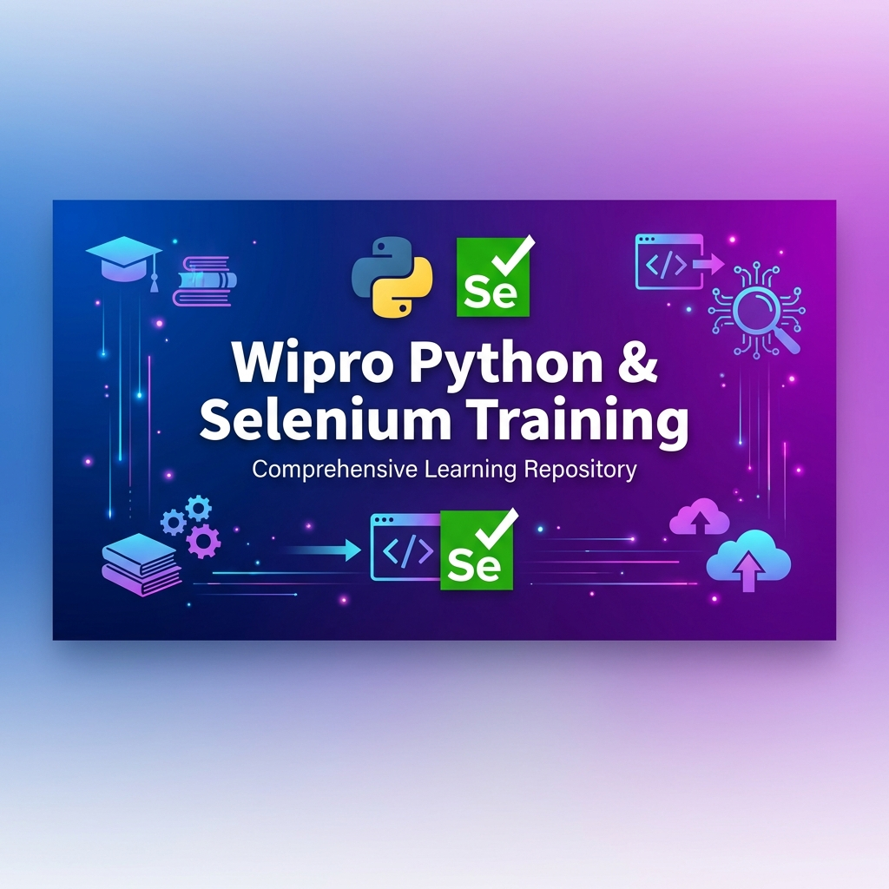

<div align="center">



# 🎓 Wipro Python & Selenium Training Repository

> A comprehensive collection of Python and Selenium WebDriver learning materials, daily practice exercises, and real-world automation case studies.

[](https://www.python.org/)
[](https://www.selenium.dev/)
[](https://flask.palletsprojects.com/)
[](https://www.crummy.com/software/BeautifulSoup/)

[](https://github.com/araj59197/WiproTraining)
[](https://github.com/araj59197/WiproTraining/stargazers)
[](https://github.com/araj59197/WiproTraining/network/members)

</div>

---

## 📑 Table of Contents

- [📌 Overview](#-overview)
- [🗂️ Repository Structure](#️-repository-structure)
- [📚 Topics Covered](#-topics-covered)
- [🚀 Getting Started](#-getting-started)
  - [Prerequisites](#prerequisites)
  - [Installation](#installation)
  - [Running Tests](#running-tests)
- [📖 Daily Breakdown](#-daily-breakdown)
- [📝 Project Structure](#-project-structure-for-each-day)
- [🔧 Technologies & Tools](#-technologies--tools)
- [📋 Case Study Questions](#-case-study-questions)
- [🎯 Learning Path](#-learning-path)
- [� Progress Tracker](#-progress-tracker)
- [💡 Tips for Learning](#-tips-for-learning)
- [🤝 Contributing](#-contributing)
- [📧 Contact](#-contact)
- [🔗 Useful Resources](#-useful-resources)

---

## �📌 Overview

This repository contains comprehensive training materials and practice code from the **Wipro Python + Selenium Training Program**. It includes:

- ✅ **Daily Structured Lessons** (Day 1 - Day 9)
- 💻 **Practical Code Examples** and test cases
- 📝 **Exercise Questions** with solutions
- 🧪 **Real-world Automation** scenarios
- 📖 **Revision Notes** and quick reference guides

<div align="center">

### 🎯 Training Duration: January 12 - January 23, 2026

</div>

---

## 🗂️ Repository Structure

```
Wipro_pre_Skilling/
│
├── 📁 Day1 12.01.2026/           # Python Fundamentals & Basics
├── 📁 Day2 13.01.2026/           # Built-in Functions, Comprehensions, Lambda
├── 📁 Day3 14.01.2026/           # File Handling, JSON, XML, CSV, Generators, Iterators
├── 📁 Day4 16.01.2026/           # OOP - Classes, Inheritance, Abstraction, Threading
├── 📁 Day5 19.01.2026/           # Advanced OOP - Method Overloading, Operator Overloading
├── 📁 Day6 20.01.2026/           # Regular Expressions
├── 📁 Day7 21.01.2026/           # Flask - Introduction & API Development
├── 📁 Day8 22.01.2026/           # Web Scraping, Requests, BeautifulSoup
├── 📁 Day9 23.01.2026/           # Selenium WebDriver & Advanced Topics
│
├── 📁 case_study_question/       # Real-world Automation Projects
├── � assets/                    # Images and Media Files
├── �📄 revision.py                # Quick Reference & Revision Notes
├── 📄 requirements.txt           # Python Dependencies
├── 📄 README.md                  # This File
└── 📄 .gitignore                 # Git Configuration

```

---

## 📚 Topics Covered

<div align="center">

| **Category** | **Topics** |
|:-------------|:-----------|
| **🐍 Python Fundamentals** | Variables, Data Types, Operators, Control Flow |
| **🔧 Functions & OOP** | Functions, Classes, Inheritance, Polymorphism, Abstraction |
| **⚡ Advanced Python** | Decorators, Generators, Iterators, Context Managers |
| **📂 File & Data Handling** | JSON, XML, CSV, File I/O |
| **🌐 Web Frameworks** | Flask (GET, POST, PUT, PATCH, DELETE) |
| **🕷️ Web Scraping** | BeautifulSoup, Requests, Selenium |
| **🤖 Selenium WebDriver** | Browser Automation, Locators, Actions, Waits |
| **✨ Best Practices** | POM, Exception Handling, Threading |

</div>

---

## 🚀 Getting Started

### Prerequisites

Before you begin, ensure you have the following installed:

-  **Python 3.8+**
-  **pip** (Python Package Manager)
-  **Git**
- 🌐 **Modern Web Browser** (Chrome, Firefox)
- 🔧 **WebDriver** (ChromeDriver for Chrome, GeckoDriver for Firefox)

### Installation

```bash
# 1️⃣ Clone this repository
git clone https://github.com/araj59197/WiproTraining.git
cd Wipro_pre_Skilling

# 2️⃣ Create a virtual environment
python -m venv venv

# 3️⃣ Activate virtual environment
# On Windows:
venv\Scripts\activate
# On macOS/Linux:
source venv/bin/activate

# 4️⃣ Install required packages
pip install -r requirements.txt
```

### Running Tests

```bash
# Run a specific test case
python "Day2 13.01.2026/TC_ArithmeticOperator.py"

# Run all tests from a specific day
python "Day3 14.01.2026/TC_Files.py"

# Run Flask application
python "Day7 21.01.2026/flask_app.py"
```

---

## 📖 Daily Breakdown

<details>
<summary><b>📅 Day 1: Python Fundamentals</b></summary>

- Variables, Data Types, Operators
- Input/Output, Type Conversion
- Control Constructs (if-else, loops)

</details>

<details>
<summary><b>📅 Day 2: Functions & Built-in Functions</b></summary>

- Functions & Parameters
- Lambda Functions
- List/Dict/Set Comprehensions
- `map()`, `filter()`, `reduce()`

</details>

<details>
<summary><b>📅 Day 3: File Handling & Data Formats</b></summary>

- File I/O Operations
- JSON Parsing
- XML Processing
- CSV Handling
- Iterators & Generators

</details>

<details>
<summary><b>📅 Day 4: Object-Oriented Programming (OOP)</b></summary>

- Classes & Objects
- Constructors & Destructors
- Inheritance (Single & Multiple)
- Abstraction & Abstract Classes
- Threading & Subprocess

</details>

<details>
<summary><b>📅 Day 5: Advanced OOP</b></summary>

- Hierarchical Inheritance
- Method Overloading
- Operator Overloading
- Method Overriding

</details>

<details>
<summary><b>📅 Day 6: Regular Expressions</b></summary>

- Pattern Matching
- String Manipulation
- Advanced Regex Operations

</details>

<details>
<summary><b>📅 Day 7: Flask Web Framework</b></summary>

- Flask Basics
- GET Requests
- POST Requests
- PUT & PATCH Requests

</details>

<details>
<summary><b>📅 Day 8: Web Automation & Scraping</b></summary>

- HTTP Requests (GET, POST, PUT, PATCH, DELETE)
- BeautifulSoup Web Scraping
- Flask Request Handling
- JSON Data Processing

</details>

<details>
<summary><b>📅 Day 9: Selenium & Advanced Topics</b></summary>

- Selenium WebDriver Basics
- Web Element Interactions
- Wait Strategies & Synchronization

</details>

---

## 📝 Project Structure for Each Day

Each day folder typically contains:

```
Day_X/
├── TC_*.py              # Test Cases & Examples
├── question/            # Practice Questions & Exercises
├── Lab Question/        # Laboratory Assignments
├── data files (JSON, CSV, XML, TXT)
└── sub-modules/         # Utility functions & helpers
```

---

## 🔧 Technologies & Tools

<div align="center">

| Technology | Purpose | Badge |
|:-----------|:--------|:------|
| **Python** | Core Programming Language |  |
| **Selenium** | Web Browser Automation |  |
| **Flask** | Web Framework |  |
| **BeautifulSoup** | Web Scraping |  |
| **Requests** | HTTP Client Library |  |
| **JSON/XML** | Data Formats |  |
| **Threading** | Concurrent Programming |  |
| **Git** | Version Control |  |

</div>

---

## 📋 Case Study Questions

The `case_study_question/` folder contains real-world automation scenarios:

- **Q1.py** - Student Report Analysis
- Real-world data processing challenges
- Integration of multiple concepts

---

## 🎯 Learning Path


---

## 📊 Progress Tracker

| Day | Topic | Status |
|:---:|:------|:------:|
| 1️⃣ | Python Basics | ✅ |
| 2️⃣ | Functions & Comprehensions | ✅ |
| 3️⃣ | File Handling | ✅ |
| 4️⃣ | OOP Concepts | ✅ |
| 5️⃣ | Advanced OOP | ✅ |
| 6️⃣ | Regular Expressions | ✅ |
| 7️⃣ | Flask Introduction | ✅ |
| 8️⃣ | Web Scraping | ✅ |
| 9️⃣ | Selenium & Advanced Topics | ✅ |

---

## 💡 Tips for Learning

> [!TIP]
> **Best Practices for Maximum Learning**

1. 🏃‍♂️ **Run Code**: Execute each example to understand how it works
2. 🔬 **Modify & Experiment**: Change parameters and observe results
3. 📚 **Practice Exercises**: Complete all lab questions and case studies
4. 📖 **Read Documentation**: Refer to official Python/Selenium docs
5. 🚀 **Build Projects**: Create small projects combining multiple concepts

> [!IMPORTANT]
> Consistent practice is key! Try to code every day, even if it's just for 30 minutes.

---

## 🤝 Contributing

Contributions are always welcome! Here's how you can help:

- 🐛 Report issues or bugs
- 💡 Suggest improvements
- ➕ Add more examples or exercises
- 📝 Improve documentation

**Steps to contribute:**

1. Fork the repository
2. Create your feature branch (`git checkout -b feature/AmazingFeature`)
3. Commit your changes (`git commit -m 'Add some AmazingFeature'`)
4. Push to the branch (`git push origin feature/AmazingFeature`)
5. Open a Pull Request

---

## 📧 Contact

<div align="center">

**👨‍💻 Aditya Raj**

[](https://github.com/araj59197)
[](https://linkedin.com)

**Training Program**: Wipro Pre-Skilling Program  
**Duration**: January 12 - January 23, 2026

</div>

---

## 🔗 Useful Resources

<div align="center">

| Resource | Link |
|:---------|:-----|
| 🐍 Python Documentation | [docs.python.org](https://docs.python.org/3/) |
| 🤖 Selenium Documentation | [selenium.dev](https://www.selenium.dev/documentation/) |
| 🌐 Flask Documentation | [flask.palletsprojects.com](https://flask.palletsprojects.com/) |
| 🕷️ BeautifulSoup Documentation | [crummy.com/software/BeautifulSoup](https://www.crummy.com/software/BeautifulSoup/) |

</div>

---

<div align="center">

### ⭐ If you find this repository useful, please give it a star!


---

**Made with ❤️ during Wipro Training Program**

*Last Updated: January 24, 2026*

</div>
